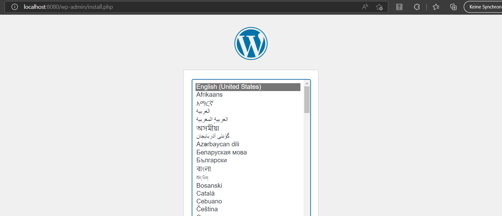

# Leistungsbeurteilung 3 Doku Edi Sherifi 
## Diese Dokumentation wurde geschrieben von Edi Sherifi. 
----------------------------------------------------------------------------
# **Inhaltsverzeichnis**
## Einleitung
## Grafische Übersicht
## Meine Umgebung
## Beschreibung des Codes
## yaml File
## Tests
## Sicherheit
## Persönliche Reflexion
## Quellen
## Kontaktperson

## Einleitung
Für die Leistungsbeurteilung 3 erstelle ich mit einer yaml-Datei eine Datenbank samt Wordpress-Page access. Mit dem Befehl "docker-compose up oder docker-compose up -d" sollten die beiden VM's automatisiert aufstarten. Ich werde dazu zwei bereits vorhandene Builds verwenden. Das ist der Sinn dahinter. Ich habe am Anfang zuerst ein anderes Projekt durchgeführt, welches jedoch scheiterte. 
Ich musste eine andere Idee finden. 

## Grafische Übersicht
Diese Grafik zeigt auf, wie die Umgebung aufgebaut ist. 

    +++++++++++++++++++++++++++++++++++++++++++++++++++++++++++++++++
    #                                                               #	
    #    +++++++++++++++++++++++++    ++++++++++++++++++++++++++    #
    #    # Web-Server            #    # Datenbank-Server       #    #       
    #    # Port: 8080            #    # Port: 3306             #    #       
    #    # Volume:/              #    # Volume: /var/lib/mysql #    #       
    #    +++++++++++++++++++++++++    ++++++++++++++++++++++++++    #
    #                                                               #	
    # Container                                                     #	
    +---------------------------------------------------------------+
    + Container-Engine: Docker                                      +	
    +---------------------------------------------------------------+
    + Gast OS: Ubuntu 16.04                                         +	
    +---------------------------------------------------------------+
    + Hypervisor: VirtualBox                                        +	
    +---------------------------------------------------------------+
    + Host-OS: Windows, MacOS, Linux                                +	
    +++++++++++++++++++++++++++++++++++++++++++++++++++++++++++++++++


## Meine Umgebung

Ich habe, wie in der grafischen Übersicht ersichtlich, eine mariadb-Datenbank aufgesetzt, mit Zugriff über WordPress
Der Zugriff erfolgt über folgenden Link: http://localhost:8080/. 

Die Kommunikation zwischen meiner Datenbank und dem Webserver erfolgt durch einen internen Netzwerk Adapter und der Zugriff auf die Datenbank (von aussen) kann über den WordPress Page mit dem Port 8080 erfolgen. 
<p></p>

Damit die VM aufstartet, muss man folgende Befehle eintippen: 

```
docker-compose up -d
```
<p></p>

## Beschreibung des Codes
Ich habe in diesem Abschnitt ein paar Teile vom Code eingefügt. Dieser Code ist essenziell für meine VMs, mit diesem Code funktioniert das gesamte Projekt. Ich habe auch ein paar Teile des Codes kommentiert, damit er verständlicher wird. 

## yaml File

**image:** mariadb:10.6.4-focal, hier holt man das Image samt Version.

**volumes:** - db_data:/var/lib/mysql, Docker-Volumes sind Dateisysteme, die an Docker-Container angehängt werden, um die vom laufenden Container erzeugten Daten zu speichern.

**restart:** always, startet Container, die mit einem Exit-Code von Null (Erfolg) beendet werden, immer neu. 

**environment:** Hier kann man zB. den Benutzernamen und das Pssswort in der zugehörigen Umgebung definieren.

**expose:** Mit expose kann man Ports freigeben, ohne sie auf dem Host-Rechner zu veröffentlichen. Sie sind nur für verknüpfte Dienste zugänglich.

**ports:** Hier kann man Ports freigeben. Man gibt entweder beide Ports oder nur den Container-Port an. 

## Tests

Zuerst muss man sicherstellen ob der Zugriff über diese URL auf den Webserver ordnungsgemäss funktioniert:
http://localhost:8080/

Wenn das geklappt hat, sollte folgendes Fenster erscheinen:


Wenn man die Sprache ausgewählt hat, kann man folgende Credentials eingeben und sich schliesslich einloggen:


## Sicherheit

## Persönliche Reflexion


## Quellen/Quellenverzeichnis

Bei einem Grossteil des Quellcodes für mein yaml-File musste ich im Internet Beispiele anschauen oder mich an Herr Bergers Vorlagen orientieren, da ich Mühe hatte das gesamte Projekt von Null zu starten. 
Trotzdem habe ich den Code verstanden und auch selbst teilweise fertig geschrieben. 
Es ist mir sehr wichtig, mein eigenes Projekt auch verstehen zu können.

|Links|
|----|
|https://hub.docker.com/|
|https://github.com/docker/awesome-compose|

## Kontaktperson

Bei Fragen oder Anliegen, wenden Sie sich bitte an folgende Kontaktperson:

|Name|Vorname|E-Mail|Firma|
|----|-----|-----|-----|
|Sherifi|Edi|edi.sherifi@edu.tbz.ch|Credit Suisse|
