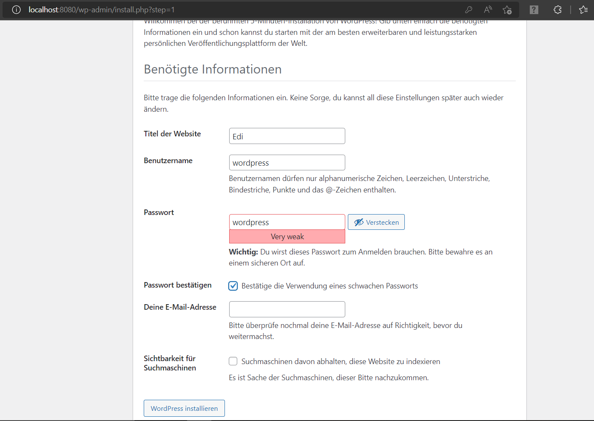
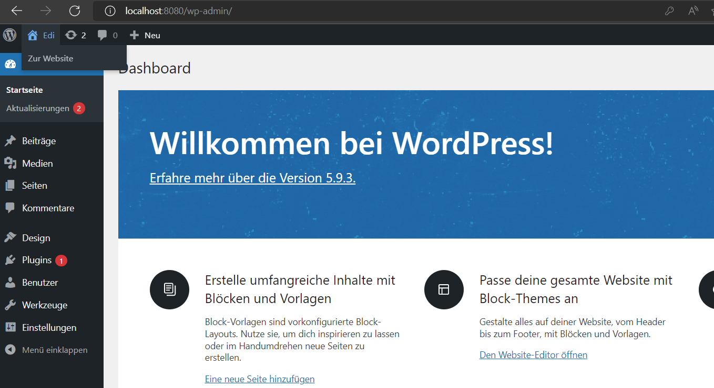

# Leistungsbeurteilung 3 Dokumentation Edi Sherifi
## Diese Dokumentation wurde geschrieben von Edi Sherifi. 
----------------------------------------------------------------------------
# **Inhaltsverzeichnis**
## Einleitung
## Grafische Übersicht
## Meine Umgebung
## Beschreibung des Codes
## yaml File
## Tests
## Sicherheit
## Persönliche Reflexion
## Quellen
## Kontaktperson

## Einleitung
Für die Leistungsbeurteilung 3 erstelle ich mit einer yaml-Datei eine Datenbank samt Wordpress-Page access. Mit dem Befehl "docker-compose up oder docker-compose up -d" sollten die beiden Container automatisiert aufstarten. Ich werde dazu zwei bereits vorhandene Builds verwenden. Das ist der Sinn dahinter. Ich habe am Anfang zuerst ein anderes Projekt durchgeführt, welches jedoch scheiterte. 
Ich musste eine andere Idee finden. 

## Grafische Übersicht
Diese Grafik zeigt auf, wie die Umgebung aufgebaut ist. 

    +++++++++++++++++++++++++++++++++++++++++++++++++++++++++++++++++
    #                                                               #	
    #    +++++++++++++++++++++++++    ++++++++++++++++++++++++++    #
    #    # Web-Server            #    # Datenbank-Server       #    #       
    #    # Port: 8080            #    # Port: 3306             #    #       
    #    # Volume:/              #    # Volume: /var/lib/mysql #    #       
    #    +++++++++++++++++++++++++    ++++++++++++++++++++++++++    #
    #                                                               #	
    # Container                                                     #	
    +---------------------------------------------------------------+
    + Container-Engine: Docker                                      +	
    +---------------------------------------------------------------+
    + Gast OS: Ubuntu 16.04                                         +	
    +---------------------------------------------------------------+
    + Hypervisor: VirtualBox                                        +	
    +---------------------------------------------------------------+
    + Host-OS: Windows, MacOS, Linux                                +	
    +++++++++++++++++++++++++++++++++++++++++++++++++++++++++++++++++


## Meine Umgebung

Ich habe, wie in der grafischen Übersicht ersichtlich, eine mariadb-Datenbank aufgesetzt, mit Zugriff über WordPress
Der Zugriff erfolgt über folgenden Link: http://localhost:8080/. 

Die Kommunikation zwischen meiner Datenbank und dem Webserver erfolgt durch einen internen Netzwerk Adapter und der Zugriff auf die Datenbank (von aussen) kann über den WordPress Page mit dem Port 8080 erfolgen. 
<p></p>

Damit die VM aufstartet, muss man folgende Befehle eintippen: 

```
docker-compose up -d
```
<p></p>

## Beschreibung des Codes
Ich habe in diesem Abschnitt ein paar Teile vom Code eingefügt. Dieser Code ist essenziell für meine VMs, mit diesem Code funktioniert das gesamte Projekt. Ich habe auch ein paar Teile des Codes kommentiert, damit er verständlicher wird. 

## yaml File

**image:** mariadb:10.6.4-focal, hier holt man das Image samt Version.

**volumes:** - db_data:/var/lib/mysql, Docker-Volumes sind Dateisysteme, die an Docker-Container angehängt werden, um die vom laufenden Container erzeugten Daten zu speichern.

**restart:** always, startet Container, die mit einem Exit-Code von Null (Erfolg) beendet werden, immer neu. 

**environment:** Hier kann man zB. den Benutzernamen und das Pssswort in der zugehörigen Umgebung definieren.

**expose:** Mit expose kann man Ports freigeben, ohne sie auf dem Host-Rechner zu veröffentlichen. Sie sind nur für verknüpfte Dienste zugänglich.

**ports:** Hier kann man Ports freigeben. Man gibt entweder beide Ports oder nur den Container-Port an. 

## Tests

Zuerst muss man sicherstellen ob der Zugriff über diese URL auf den Webserver ordnungsgemäss funktioniert:
http://localhost:8080/

Wenn das geklappt hat, sollte folgendes Fenster erscheinen:


Wenn man die Sprache ausgewählt hat, kann man folgende Credentials eingeben und sich schliesslich einloggen:




So sieht es letztendlich aus, wenn man sich eingeloggt hat: 



## Sicherheit

Die Sicherheit hat in der Welt von Docker eine bedeutende Rolle. Es gibt verschiedene Möglichkeiten, seinen Container abzusichern.
Ich werde hier ein paar Beispiele auflisten.

* Jeder Container läuft mit aktueller Software und im Produktivmodus – Die Debug-Informationen sind abgeschaltet.
* Services wie Apache oder MySQL sind mit einer Zugriffskontrolle oder einem Passwortschutz ausgestattet. Dieser Punkt ist sehr einfach umzusetzen. 
* Die Anwendung wird überwacht und es wird ein Alarm ausgelöst, wenn eine ungewöhnliche Netzwerklast oder auffällige Zugriffsmuster erkannt werden.
* Neustarts begrenzen: Wenn ein COntainer immer wieder stirbt und dann neugestartet wird, muss das System nicht unerheblich Zeit und Ressourcen aufwenden
* Dateisysteme werden weitestgehend schreibgeschützt eingesetzt, sodass Angreifer Daten nicht einfach überschreiben können. 


## Persönliche Reflexion
In diesem Projekt habe ich sehr viel über das Thema Docker gelernt. Wie schon beim ersten Thema Vagrant, kannte ich mich vorher überhaupt nicht aus in diesem Themengebiet und das machte die Situation wiederum nicht einfacher. Das Ziel war es, die Welt von Docker genauso gut verstehen zu können wie Vagrant. Ich war gespannt auf mein Projekt. Dank den Präsentationen von Herrn Berger konnte ich sehr viel über die Einzelheiten von Docker lernen und das Thema wurde mir von Modultag zu Modultag immer klarer. Herr Berger hat mir dieses Thema spannend näher gebracht. Dennoch habe ich anfangs Schwierigkeiten gehabt und musste viel nachfragen bzw. im Internet recherieren. Ich wusste zuerst nicht, was für ein Projekt ich wählen sollte, letztendlich liess ich mich von den vielen Beispielen im Internet inspirieren und ich wollte ein etwas komplexeres Projekt durchführen. 
Am Anfang lief es gut, doch dann kamen sehr viele Fehlermeldungen. Ich habe sehr lange versucht, alle Errors zu finden und beseitigen, doch dieser Prozess kostete mich viel Zeit und ich musste leider auf ein einfacheres Projekt ausweichen, aber ich war trotzdem sehr motiviert, ein gutes Projekt samt Dokumentation abzuliefern.

Ich habe es geschafft, den Code zu verstehen und zu beschreiben in der Dokumentation. 
Das Projekt war eine tolle Erfahrung und nun weiss ich wie man ein yaml-File erstellt, welches man ganz einfach mit docker-compose up starten kann. 

Während dem Projekt fühlte ich mich nicht verloren, da ich immer tolle Unterstützung von Herrn Berger erhalten habe. Da mein erstes Projekt scheiterte und mir deshalb die Zeit ausging, konnte ich nicht das Optimum rausholen aus dem Projekt.

Alles in Allem kann ich behaupten, dass dieses Modul trotzdem ein grosser Erfolg war und ich jetzt über sehr viel Wissen auf diesem Themengebiet verfüge. 

## Quellen/Quellenverzeichnis

Bei einem Grossteil des Quellcodes für mein yaml-File musste ich im Internet Beispiele anschauen oder mich an Herr Bergers Vorlagen orientieren, da ich Mühe hatte das gesamte Projekt von Null zu starten. 
Trotzdem habe ich den Code verstanden und auch selbst teilweise fertig geschrieben. 
Es ist mir sehr wichtig, mein eigenes Projekt auch verstehen zu können.

|Links|
|----|
|https://hub.docker.com/|
|https://github.com/docker/awesome-compose|

## Kontaktperson

Bei Fragen oder Anliegen, wenden Sie sich bitte an folgende Kontaktperson:

|Name|Vorname|E-Mail|Firma|
|----|-----|-----|-----|
|Sherifi|Edi|edi.sherifi@edu.tbz.ch|Credit Suisse|
