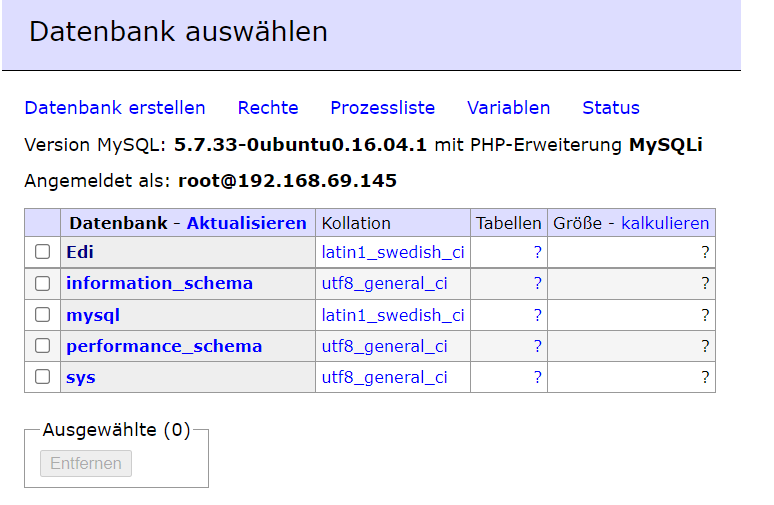

# LB2 Doku Edi Sherifi 
## Diese Dokumentation ist ein Produkt von Edi Sherifi. 
----------------------------------------------------------------------------
# **Inhaltsverzeichnis**
## Einleitung
## Grafische Übersicht
## Meine Umgebung
## Beschreibung des Codes
## Vagrantfile
## Databaseconf Script
## Tests
## Sicherheit
## Persönliche Reflexion
## Quellen
## Kontaktperson


## Einleitung
Für die Leistungsbeurteilung 2 erstelle ich mit meinem Vagrantfile einen Webserver mit einer Datenbank dahinter. Es wird eine Webseite und Datenbank gehostet. Ich kann mich per Website mit einem Benutzer und Passwort auf der Datenbank anmelden. Mit dem Befehl "vagrant up" sollten die beiden VM's automatisiert aufstarten. Das ist der Sinn dahinter. 

## Grafische Übersicht
Dieses Bild zeigt auf wie die Umgebung aufgebaut ist. 

    
     Notebook - Privates Netz 192.168.69.1                 
     Port: 8080 (192.168.69.145:80)                                                           	
        %%%%%%%%%%%%%%%%%%%%%%              %%%%%%%%%%%%%%%%%%%%%%%   
        = Web-Server         =              = Datenbank-Server    =           
        = Host: Webserver1 =              = Host: Datenbank1    =    
        = IP: 192.168.69.145 = <Connection> = IP: 192.168.69.144  =    
        = Port: 80           =              = Port 3306           =    
        = Nat: 8080          =              = Nat:                =    
        %%%%%%%%%%%%%%%%%%%%%%              %%%%%%%%%%%%%%%%%%%%%%%


## Meine Umgebung

Ich habe, wie oben bereits erwähnt, einen Webserver und eine Datenbank aufgesetzt. Selbstverständlich kann man mit dem Tool [Adminer](https://www.adminer.org/) auf die Datenbank zugreifen.
<p></p>

Die Kommunikation zwischen meiner Datenbank und dem Webserver erfolgt durch einen internen Netzwerk Adapter und der Zugriff auf die Datenbank (von aussen) kann nur über den Webserver mit dem Port 8080 erfolgen. Oben kann man die grafische Übersicht samt IP-Adressen sehen.  
<p></p>

Damit die VM aufstartet, muss man folgende Befehle eintippen: 

```Vagrant
vagrant up
```

Um zu den jewiligen VMs eine SSH-Verbindung herzustellen soll man folgendes eintippen:

```Vagrant
vagrant ssh database
vagrant ssh web
```
<p></p>

Das MySQL Adminer User Interface ist via http://localhost:8080/adminer.php mit folgenden Log-In Daten erreichbar:

```Vagrant
Datenbank System: MySQL
Server: datenbanklb2
Benutzer: root
Passwort: ediedi-123
Datenbank: Datenbank1
```

## Beschreibung des Codes

Ich habe in diesem Abschnitt ein paar Teile vom Code eingefügt. Dieser Code ist essenziell für meine VMs, mit diesem Code funktioniert das gesamte Projekt. Ich habe auch ein paar Teile des Codes kommentiert, damit er verständlicher wird. 


### Vagrantfile

Die Hauptfunktion der Vagrant-Datei besteht darin, den erforderlichen (VM) Maschinentyp zu beschreiben und wie ich diese Maschinen konfiguriert habe. [(https://www.vagrantup.com/docs/vagrantfile)](https://www.vagrantup.com/docs/vagrantfile)


Hier sollte man nichts berühren Bei diesem Teil sollte man nicht zu viel herumhantieren, ausser man verfügt über das nötige Know-How, da immer die richtige API Version bei frt aktuellen Vorlage angegeben ist.

```Vagrant
VAGRANTFILE_API_VERSION = "2"

Vagrant.configure(VAGRANTFILE_API_VERSION) do |config|
```

Hier wird die VM "Datenbank1" erstellt und die eingestellten Parameter sind erscihtlich, zB. wie viel RAM man der Maschine gibt. Wichtig ist auch die Zeile:

```Vagrant
  	db.vm.provision "shell", path: "databaseconf.sh"
```
Bei dieser Zeile gibt man an, dass man mit der Datei "databaseconf" die database VM konfiguriert. Die Provisioner in Vagrant ermöglichen es, im Rahmen des Vagrant-Up-Prozesses, Software automatisch zu installieren und Konfigurationen zu verändern etc.

[(https://www.vagrantup.com/docs/provisioning)](https://www.vagrantup.com/docs/provisioning)


```Vagrant
config.vm.define "database" do |db|
    db.vm.box = "ubuntu/xenial64"
	db.vm.provider "virtualbox" do |vb|
	  vb.memory = "512"  
	end
	
    db.vm.hostname = "Datenbank1"
    db.vm.network "private_network", ip: "192.168.69.144"
  	db.vm.provision "shell", path: "databaseconf.sh"
  end
```
<p></p>
Bei diesem teil des Codes ist der Aufbau des Webservers ersichtlich samt Parameter. zB. der Port (80) beim Guest wird zum Port 8080 vom Host (Dem Laptop) weitergeleitet (Port forwarding)
<p></p>
Falls der Port bereits besetzt sein sollte, gibt es auch dafür eine Lösung: Der Port wird automatisch mit der "auto_correct: true"
Funktion auf einen anderen verfügbaren Port weitergeleitet.

```Vagrant
config.vm.define "webserver" do |web|
    web.vm.box = "ubuntu/xenial64"
    web.vm.hostname = "Webserver1"
    web.vm.network "private_network", ip:"192.168.69.145" 
	web.vm.network "forwarded_port", guest:80, host:8080, auto_correct: true
	web.vm.provider "virtualbox" do |vb|
	  vb.memory = "512"  
	end 
```
<p></p>

Mithilfe dieses Codes greift man auf den erstellten Webserver zu und die Ordnerstruktur von der VM (/var/www/html) wird mit der Ordnerstruktur vom Laptop wo das Vagrantfile liegt synchronisiert. 
Anschliessend wird die Shell, also die Kommandozeile von Linux, geöffnet und die Dienste Apache, PHP sowie Adminer werden automatisch installiert.

```Vagrant
web.vm.synced_folder ".", "/var/www/html"  
	web.vm.provision "shell", inline: <<-SHELL
		sudo apt-get update
		sudo apt-get -y install debconf-utils apache2
		sudo debconf-set-selections <<< 'mysql-server mysql-server/root_password password ediedi123.'
		sudo debconf-set-selections <<< 'mysql-server mysql-server/root_password_again password ediedi123.'
		sudo apt-get -y install php libapache2-mod-php php-curl php-cli php-mysql php-gd mysql-client 
		sudo mkdir /usr/share/adminer
		sudo wget "http://www.adminer.org/latest.php" -O /usr/share/adminer/latest.php
		sudo ln -s /usr/share/adminer/latest.php /usr/share/adminer/adminer.php
		echo "Alias /adminer.php /usr/share/adminer/adminer.php" | sudo tee /etc/apache2/conf-available/adminer.conf
		sudo a2enconf adminer.conf 
		sudo service apache2 restart 
	 echo '127.0.0.1 localhost Webserver1\n192.168.69.145 Datenbank1' > /etc/hosts
SHELL
	end  
 end
```
<p></p>


### Databaseconf Script

Dieses Script wurde im Vagrantfile als Provision der Datenbank angegeben und so wird die VM der Datenbank automatisiert aufgesetzt mit den Konfigurationen in der Shell und der MySQL Datenbank selbst.

<p></p>

Hier wird das Passwort der Datenbank definiert und gleichzeitig wird die Datenbank auch installiert:

```Vagrant
sudo debconf-set-selections <<< 'mysql-server mysql-server/root_password password ediedi-123'
sudo debconf-set-selections <<< 'mysql-server mysql-server/root_password_again password ediedi-123'
sudo apt-get install -y mysql-server
sudo sed -i -e"s/^bind-address\s*=\s*127.0.0.1/bind-address = 0.0.0.0/" /etc/mysql/mysql.conf.d/mysqld.cnf
```

In diesem Abschnitt werden die SQL Befehle direkt in der Datenbank (Datenbank1) ausgeführt. Eine Tabelle sowie auch eine Testperson werden erstellt. Letztlich startet man den MySQL Service neu.

```mysql -uroot -pediedi-123 <<%EOF%
	
CREATE USER 'root'@'192.168.69.144' IDENTIFIED BY 'ediedi-123';
	GRANT ALL PRIVILEGES ON *.* TO 'root'@'192.168.69.144';
	FLUSH PRIVILEGES;
	
	CREATE DATABASE projektlb2;
	
	USE projektlb2;
	
CREATE TABLE Persons (
    PersonID int,
    LastName varchar(255),
    FirstName varchar(255),
    Address varchar(255),
    City varchar(255)
);
	
	
INSERT INTO Persons (LastName, FirstName, Address, City)
VALUES ('Sherifi', 'Eddie', 'Steinstrasse', Dietikon); 
	
%EOF%


sudo service mysql restart
```


## Tests

Zuerst muss man sicherstellen ob der Zugriff über diese URL auf den Webserver ordnungsgemäss funktioniert:
http://localhost:8080/adminer.php

Anschliessend kann man sich mit den untenstehenden Crendentials einloggen:

```Vagrant
Datenbank System: MySQL
Server: Datenbank1
Benutzer: root
Passwort: ediedi-123
Datenbank: Datenbank1
```

Danach erscheint folgender Bildschirm:



Man kann nach "Spaghetti" in der Suchleiste suchen --> unter der Tabelle "Food" sollte folgender Datensatz hervorkommen:


Somit hat man geprüft, ob man sich Log On auf die Datenbank klappt und ob man per Script eine Tabelle erstellen und Daten automatisiert einfügen kann.

## Sicherheit
Es wurde ein Passwort mit Sonderzeichen genommen, damit Hackerattacken scheitern.
Die Datenbank ist nur über eine Private Verbindung über den Webserver erreichbar.
Leider verwendet der Webserver das unsichere HTTP Protokoll und ist folglich auch unsicherer als das verschlüsselte HTTPS Protokoll.


## Persönliche Reflexion
In diesem Projekt habe ich sehr viel über das Thema Vagrant und GitHub lernen können. Ich kannte mich vorher überhaupt nicht mit diesem Thema aus und wurde daher in kalte Wasser geworfen. Die Präsentationen und interaktiven Lektionen mit Herr berger haben mir das Gesamte ein wenig näher gebracht und ich konnte mich so auch langsam aber sicher in die Themen einarbeiten. Dennoch habe ich Schwierigkeiten gehabt und benötigte ab und an Hilfe von Herr Berger. Ich habe versucht, den Code zu verstehen und meine MySQL-Kenntnisse bei der Datenbank einfliessen zu lassen. Das Projekt war eine tolle Erfahrung und nun kenn ich zumindest die Basis für die erleichterte und automatisierte Erstellung einer Datenbank. 

Während dem Projekt fühlte ich mich nicht verloren, da ich immer Unterstützung erhalten habe. Ich war leider eine Woche lang krank und konnte deshalb nicht das Maximum rausholen aus dem Projekt.

Alles in Allem kann ich behaupten, das ich trotzdem erfolgreich war und doch viel mitnehme aus dieser LB2. 

## Quellen/Quellenverzeichnis

Bei einem Grossteil des Quellcodes für beide musste ich mich bei Herr Bergers Vorlage bedienen, da ich Mühe hatte das gesamte Projekt von Null zu starten. Trotzdem habe ich den Code verstanden und auch selbst teilweise fertig geschrieben. 
Es ist mir sehr wichtig, mein eigenes Projekt auch verstehen zu können.

|Links|
|----|-----|-----|
|https://www.vagrantup.com/docs/provisioning|
|https://www.adminer.org/|

## Kontaktperson

Bei Fragen oder Anliegen, wenden Sie sich bitte an folgende Kontaktperson:

|Name|Vorname|E-Mail|Firma|
|----|-----|-----|-----|
|Sherifi|Edi|edi.sherifi@edu.tbz.ch|Credit Suisse|


   
                                                                       
